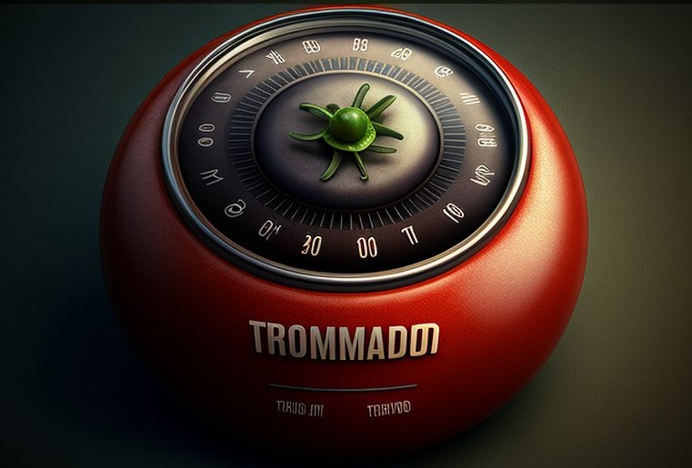
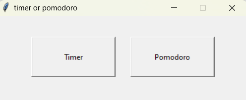
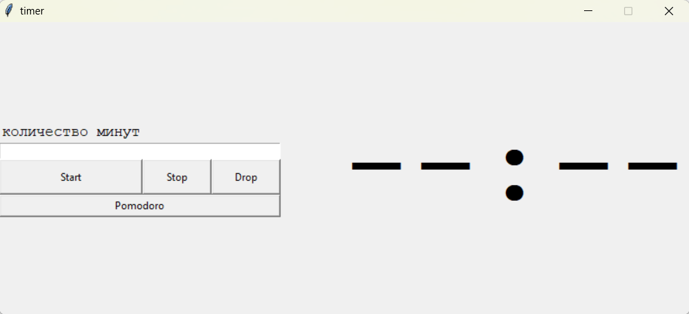
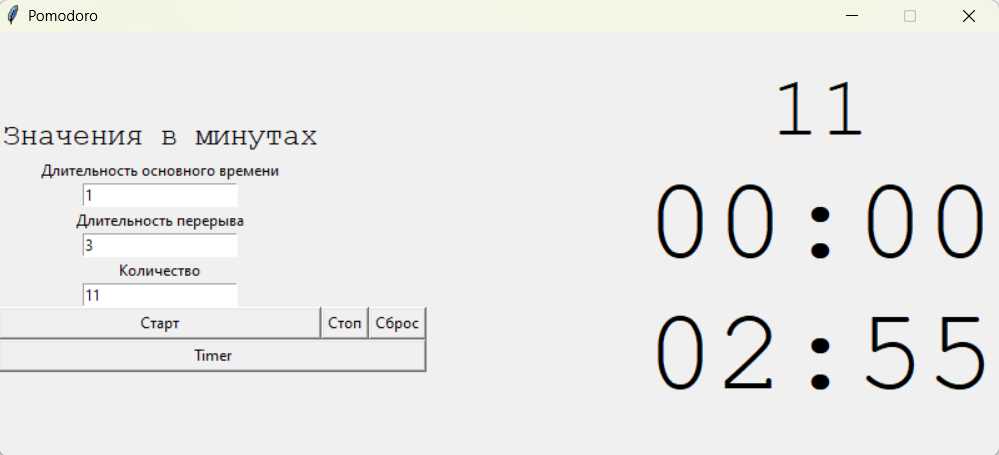

<h1>timer or pomodoro</h1>

<h2>Описание</h2> 
Приложение с графическим интерфейсом, которая выполняет функции таймера. Сам таймер имеет два режима: обратный отсчет 
и таймер "pomodoro". Приложение "упаковано" в exe, что позволяет запускать на ПК. 
Работа приложения начинается с окна выбора режима:

При выборе "timer", откроется окно, где можно запустить таймер или перейти к "pomodoro":

При выборе "pomodoro", откроется окно, где можно запустить таймер "pomodoro" или перейти к обычному таймеру:

Пример работы приложения: 

<h2>Зачем это?</h2> 

Данное приложение рассматривалась как практическая работа для изучения основ:
* фреймворка Tkinter
* связи функций между файлами
* принципов ООП
* работы библиотек для "упаковки" в exe 

Для решения этих задач было реализовано две версии приложения: первая версия написано только при помощи функций, 
вторая версия использовала принципы ООП. Первая реализация вышла немного запутанной и имеет ряд небольших проблем, 
которые были исправленный во второй. 

<h2>Установка и запуск</h2> 

<h3>Для работы с кодом</h3> 
Данное приложение не имеет сторонних библиотек. Tkinter является внутренним фреймворком Python. Для работы с кодом 
нужно установить интерпретатор Python, IDE и клонировать репозиторий. 
Установить интерпретатор: https://www.python.org/downloads/
Выбрать IDE: https://habr.com/ru/companies/skillfactory/articles/521838/
Адрес репозитория: https://github.com/KorytkoSergey/timer
Далее если вам интересна версия с функциями, то запуск совершаем с файла Screen_1.py, если версия с классами, то 
запускаем файл main.py. 

**Важно помнить, что при запуске в консольной строке, в системе которая не поддерживает графический интерфейс, 
произойдет ошибка. Tkinter использует графические элементы самой операционной системы, а значит если этих элементов 
нет, то и рисовать Tkinter'у не из чего.** 

<h3>Просто запуск</h3> 

Для обычного запуска и использования достаточно запустить timer.exe или main.exe

<h2>Использование</h2> 
 
Для замера времени вводим количество минут, которые нужно замерить. Если нужно например 6 минут 30 секунд, то пишем 
6,5. Допускается ввод дробных чисел как с ',', так и с '.'
Кнопка "Старт" запускает время, кнопка "Стоп" останавливает текущее значение, "Сброс" устанавливает значение 00:00

<h2>Ошибки</h2> 

В версии timer.exe(Screen_1.py) не корректно работают кнопки "Стоп" и "Сброс". Данная проблема решена во второй 
версии(main.exe или main.py).

 

